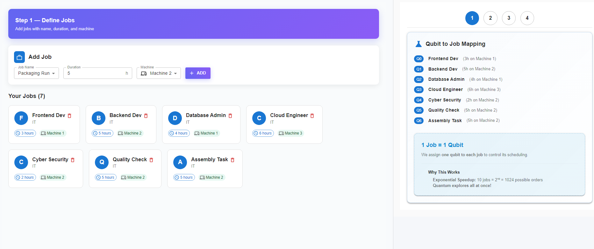
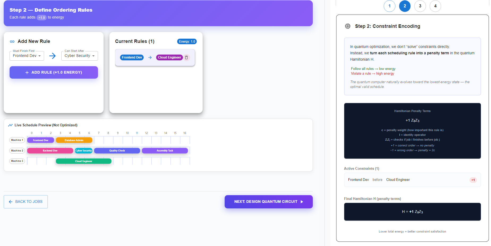
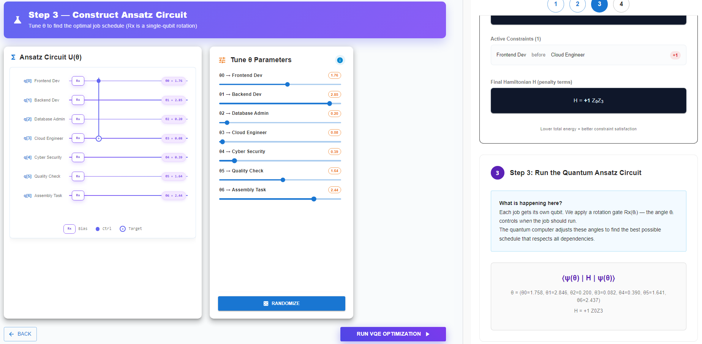
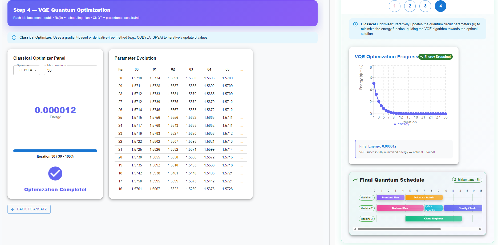

**1. Define Jobs**

Begin by defining the jobs that need to be scheduled.

Use the **Add Job** section to enter the following details:

- **Job Name** – Select or enter the job identifier.
- **Duration** – Specify the time required to complete the job.
- **Machine** – Choose the machine where the job will run.

Click **ADD** to include the job in the job list.

Once added, the system displays all jobs with their duration and assigned machines.  
Each job is also mapped to a **qubit**, meaning **1 job corresponds to 1 qubit** in the quantum model.

This mapping allows the quantum system to represent different job scheduling possibilities.

  

**2. Define Ordering Rules (Constraints)**

Next, define the scheduling rules that specify **dependencies between jobs**.

Use the **Add New Rule** panel to create constraints such as:

- A job **must finish before** another job starts.

Select:

- **Must Finish First** – the job that must complete first.
- **Can Start After** – the job that must start later.

Click **ADD RULE** to add the constraint.

Each rule adds a **penalty term to the Hamiltonian energy function**:

- Following all rules → **lower energy**
- Violating a rule → **higher energy**

The **Live Schedule Preview** shows the current schedule before optimization.

  

**3. Construct the Ansatz Circuit**

In this step, a **parameterized quantum circuit (ansatz)** is created to represent possible scheduling solutions.

Each job corresponds to a qubit, and a **rotation gate $R_x(\theta)$** is applied to each qubit.

The parameters $\theta$ control the scheduling bias for each job.

Use the **$\theta$ parameter sliders** to adjust the rotation angles for different jobs.

The ansatz circuit diagram shows:

- **Qubits representing jobs**
- **Rotation gates $R_x(\theta)$** applied to each qubit
- **Entanglement connections** representing job dependencies

These parameters will later be optimized to find the best schedule.

  

**4. Run VQE Quantum Optimization**

Finally, run the **Variational Quantum Eigensolver (VQE)** to find the optimal schedule.

Click **Run VQE Optimization** to start the process.

During optimization:

- A **classical optimizer** (such as COBYLA or SPSA) updates the circuit parameters.
- The algorithm minimizes the **Hamiltonian energy function**, which represents scheduling constraints.

The system displays:

- **Parameter evolution across iterations**
- **Energy reduction during optimization**
- **Final optimized energy value**

Once optimization completes, the system outputs the **final optimized job schedule**.

The optimal schedule corresponds to the **lowest energy configuration**, meaning all constraints are satisfied as effectively as possible.

